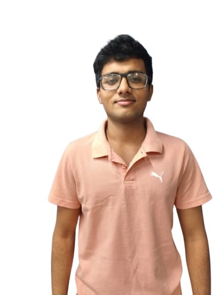

<h1 align="center">Hi there! 👋 I'm Anshul Kumar</h1>

<h3 align="center">Aspiring Software Development Engineer | Competitive Programmer | VIT Bhopal</h3>

<br/>

<div align="center">
  
</div>

<br/>

<div align="center">

[](https://portfolio-dusky-seven-53.vercel.app/)
[](https://www.linkedin.com/in/anshulkumar07/)
[](https://github.com/anshullakra007)
[](https://codeforces.com/profile/anshullakra8)
[](mailto:anshullakra8@gmail.com)

</div>

<br/>

<center>

[](https://forthebadge.com) &nbsp;
[](https://forthebadge.com) &nbsp;
[](https://forthebadge.com) &nbsp;
 &nbsp;


</center>

<h3 align="center">
    🔹
    <a href="https://github.com/anshullakra007/portfolio/issues">Report Bug</a> &nbsp; &nbsp;
    🔹
    <a href="https://github.com/anshullakra007/portfolio/issues">Request Feature</a>
</h3>

---

## 👨‍💻 About Me

I'm **Anshul Kumar**, a passionate developer from **Bahadurgarh, Haryana** currently pursuing B.Tech in Computer Science and Engineering at **VIT Bhopal**.

I love building high-performance systems, exploring competitive programming, and developing intuitive web applications.

- 🎓 B.Tech CSE @ **VIT Bhopal**
- 🏠 Based in **Bahadurgarh, Haryana, India**
- 💡 Passionate about **DSA, Distributed Systems & Competitive Programming**
- 📫 Reach me at **anshullakra8@gmail.com** | **+91 8307815380**

---

## 🛠 Tech Stack

| Layer | Technologies |
|-------|-------------|
| **Languages** | Java (JDK 21), C++ (STL), JavaScript (ES6+), Python, SQL |
| **Backend** | Spring Boot 3, Docker, Microservices, System Design |
| **Frontend** | React.js, Socket.io, Tailwind CSS, REST APIs |
| **Tools** | VS Code, IntelliJ IDEA, Git, Postman, Vercel |

---

## 🚀 Featured Projects

| Project | Description | Tech |
|---------|-------------|------|
| **ReconAI** | FinTech Operations Dashboard | Python, AI/ML, React |
| **Sentinel AI** | AI-powered security system | Python, OpenCV |
| **Distributed Code Engine** | Remote code execution in Docker | Java, Spring Boot, Docker |
| **SyncDraw** | Collaborative whiteboard | React, Socket.io, WebSockets |
| **MiniRedis** | In-memory key-value store | Java, TCP |
| **L7 Load Balancer** | Application-layer load balancer | Java, Spring Boot |

---

## ✨ Portfolio Features

**📖 Multi-Page Layout** — Home, About, Projects & Resume sections

**🎨 Dark Theme** — Styled with React-Bootstrap and custom CSS with purple accents

**📱 Fully Responsive** — Works perfectly on desktop and mobile

**⚡ Animated UI** — Particle background, typewriter effect, tilt cards

**🚀 10 Featured Projects** — Including ReconAI, Distributed Code Engine, SyncDraw, MiniRedis and more

---

## 🚀 Getting Started

Clone this repository. You will need `node.js` and `git` installed globally on your machine.

### 🛠 Installation & Setup

```bash
# Clone the repo
git clone https://github.com/anshullakra007/portfolio.git

# Install dependencies
cd portfolio
npm install

# Start development server
npm start
```

Open [http://localhost:3000](http://localhost:3000) to view it in the browser.

### 📁 Project Structure

```
src/
├── components/
│   ├── Home/          # Hero section & intro
│   ├── About/         # About, skills & GitHub stats
│   ├── Projects/      # Project showcase cards
│   └── Resume/        # Resume viewer
```

---

## 🙏 Acknowledgements

This portfolio is built on top of the [soumyajit4419/Portfolio](https://github.com/soumyajit4419/Portfolio) template. Credit to the original author for the beautiful design foundation.

---

<div align="center">
  Give a ⭐ if you like this website!
  <br/><br/>
  <strong>Made with ❤️ by <a href="https://github.com/anshullakra007">Anshul Kumar</a></strong>
</div>
